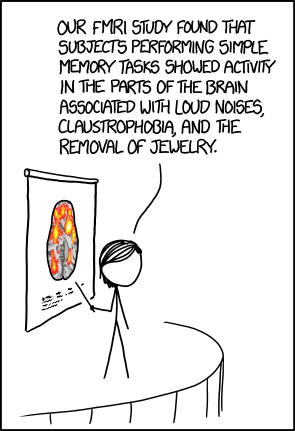
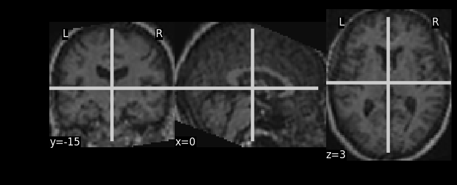

The human brain is possibly one of the most complex structures in the universe, as judged by some human brains. The past few years have seen a huge burst of [popularity](https://www.sciencedaily.com/releases/2017/04/170420093736.htm) in brain-related research. With regards to [fMRI](#fmri) based research since its discovery in the 1990s, showing correlations (_this is your brain on ..._) with what generally excites people ([sex](https://www.ncbi.nlm.nih.gov/pmc/articles/PMC4782579/), [food](http://journals.plos.org/plosone/article?id=10.1371/journal.pone.0131727) and [politics](https://www.nature.com/articles/srep39589)) has captured the public imagination. This has led to [criticism](https://www.newyorker.com/news/news-desk/neuroscience-fiction) about whether such conclusions can be or should be drawn.

<table align="center">
  <caption align="bottom"><a href="https://xkcd.com/1453/">xkcd cracks a joke on fMRI and its effectiveness</a></caption>
  <tr><td></td></tr>
</table>

Unfortunately, what has not come too much into the public view is the use of fMRI to understand neurodegenerative diseases in a better way. There is ongoing research into finding early ways of distinguishing patients suffering from  [Alzheimer's disease](https://www.ncbi.nlm.nih.gov/pubmed/20541837), [schizophrenia](https://rd.springer.com/chapter/10.1007/978-3-319-02913-9_52) and [depression](https://peerj.com/preprints/412.pdf).

>Here, we will focus on [Parkinson's Disease](#pd) (henceforth PD) and show how we can use Data Analysis to help in combating it.

Below, we present the story of our project, starting with the science behind it, leading up to the description of the dataset and onto the data analysis part.
* [Science](#thescience)
  * [What is fMRI?](#fmri)
  * [What is Parkinson Disease?](#pd)
  * [Why is it important to use Data Analysis?](#ytho)
* [Dataset](#thedataset)
* [A Future Clinic](#afutureclinic)
* [A Question...](#aquestion)

---

## Science
---

### What is fMRI?
Functional magnetic resonance imaging ([fMRI](https://en.wikipedia.org/wiki/Functional_magnetic_resonance_imaging)) is a way to measure brain activity indirectly by using the fact that increase in activity in a region of the brain is often coupled with increase in blood flow to that region. It has been widely used by cognitive neuroscientists and psychologists to examine the neural correlates of higher cognitive functions in humans, such as decision-making, emotion regulation, social interactions and consciousness.

### What is Parkinson's Disease?
Parkinson's disease ([PD](https://en.wikipedia.org/wiki/Parkinson%27s_disease)) is a disease caused by a progressive dying of certain cells in the central nervous system responsible for producing a chemical called dopamine, used to allow brain cells to communicate with each other. Their loss produces great changes in the control of voluntary movements. So, patients start showing symptoms like rigidity, tremor (involuntary shaking) or general difficulties in movements. In advanced stages, behavioural problems like dementia also appear.

### Why is it important to use Data Analysis?
Data Analysis can help in understanding the _mechanisms_ underlying the pathophysiology of PD, _early diagnosis_ of PD and also _evaluating treatments_.In general, PD can progress in a person without much external symptoms, till it is too late. So, early diagnosis becomes extremely important.

Different regions of the brain typically activate together in what neuroscientists call "brain networks". Those networks are used to study brain architecture and function. Resting state fMRI allows to study the networks that are active when a person is at rest, not performing any particular task. Those networks are typically robust among subjects, while they are destroyed or disorganized as a consequence of several brain diseases, like PD. We can analyze the fMRI data to find out the differences between the networks.

---

## Dataset
---
The [Parkinson's Progression Markers Initiative (PPMI) dataset](http://www.ppmi-info.org/) includes different types of biological data available to the scientific community, included advanced imaging data such as resting-state-fMRI and anatomical imaging. From the PPMI website it is possible to download the data for each type of imaging already divided in folders corresponding to each patient. The data is anonymised. In particular we are interested to access to anatomical and resting-state-fMRI data. It is necessary to apply for accessing the data. Since we have already been using it, we have already the access to the data, but we would make a new access request with a new proposed analysis specific to this project.
The processing pipeline could be applied, for example following the processing stream proposed by the [openfMRI project](https://openfmri.org/data-processing-stream/) and also [here](https://github.com/poldrack/openfmri)

---

## A Future Clinic
---
Our story now follows us to a clinic, in the not too distant future. The DAAD scientist or Data (Analysis-Against-Diseases) Scientist sees the patient and knows that he or she already has some data on the patient's fMRI. They first look at the anatomical data for a preliminary glance.
<table align="center">
  <caption align="bottom">Example of Anatomical Data</caption>
  <tr><td></td></tr>
</table>
After the preliminary glance, they apply the same processing on the patient's fMRI data as done on the dataset obtained from PPMI in the background, the [boring details](https://github.com/sharbatc/ada2017hw/blob/master/project/final_project.ipynb) of which, you might care to look at. The processing involves using components

And the DAAD scientist arrives at the time series of the patient's fMRI, the connectivity matrix of different areas of the brain and the layers of the CNN

---

## A Question
---
If in the future, a DAAD scientist can predict with good probability from just the fMRI, about diseases, would you like to know about early onset of even diseases which are known to be terminal without any cure, or would you rather not?
---
_Food for thought..._
---

<!-- Uncomment the following to get blog posts, not needed for ADA -->

<!-- 

  
  <article class="post-preview">
    <a href="{{ post.url | prepend: site.baseurl }}">
	  <h2 class="post-title">{{ post.title }}</h2>

	  
	  <h3 class="post-subtitle">
	    {{ post.subtitle }}
	  </h3>
	  
    </a>

    

      Posted on {{ post.date | date: "%B %-d, %Y" }}
    

    

      
      

        
      

      
      

        {{ post.excerpt | strip_html | xml_escape | truncatewords: site.excerpt_length }}
        
        
          <a href="{{ post.url | prepend: site.baseurl }}" class="post-read-more">[Read&nbsp;More]</a>
        
      

    

    
    

      Tags:
      
      
      <a href="{{ site.baseurl }}/tag/{{ tag }}">{{ tag }}</a>
      
      
        {{ post.tags | join: ", " }}
      
    

    

   </article>
  


<ul class="pager main-pager">
  
  <li class="previous">
    <a href="{{ paginator.previous_page_path | prepend: site.baseurl | replace: '//', '/' }}">&larr; Newer Posts</a>
  </li>
  
  
  <li class="next">
    <a href="{{ paginator.next_page_path | prepend: site.baseurl | replace: '//', '/' }}">Older Posts &rarr;</a>
  </li>
  
</ul>
 -->
